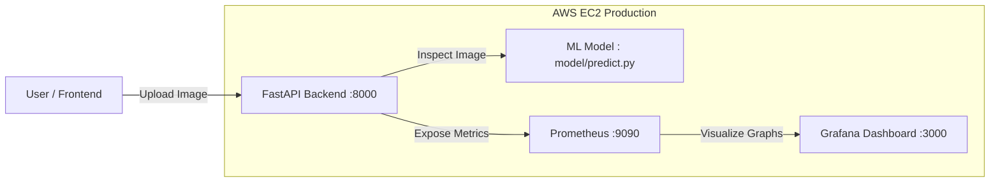
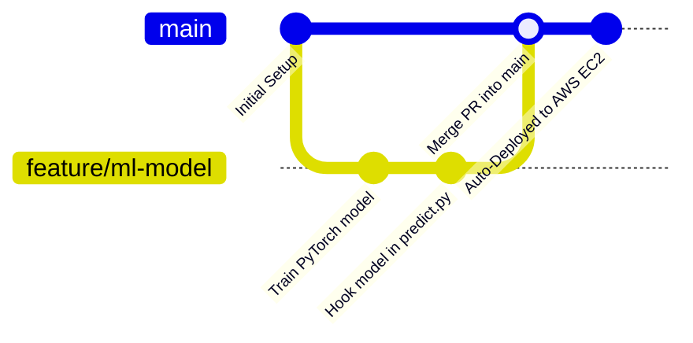

# 🚀 SignalScope — Team DevOps & Quickstart Guide

> **Project:** SignalScope — AI-Generated Image Detector (Real vs Fake Classifier)  
> **Hackathon:** Smart India Hackathon (SIH 2026)  
> **Repository:** [https://github.com/mihir021/SignalScope](https://github.com/mihir021/SignalScope)  
> **Live Server URL:** `http://18.212.83.78:8000` (AWS EC2)

Welcome to the **SignalScope** project! This guide is written so that **any teammate** — whether you are working on the Machine Learning model, the Frontend, testing, or presenting to judges — can easily understand the project, run it on your own computer, test the API, and deploy changes to the cloud.

---

## 🧭 Table of Contents
1. [What is SignalScope & How Does It Work?](#1-what-is-signalscope--how-does-it-work)
2. [Folder Structure (Where Does My Code Go?)](#2-folder-structure-where-does-my-code-go)
3. [How to Run SignalScope Locally on Your Laptop](#3-how-to-run-signalscope-locally-on-your-laptop)
   - [Method A: 1-Click Docker Setup (Recommended)](#method-a-1-click-docker-setup-recommended)
   - [Method B: Python Virtual Environment (For Fast ML Dev)](#method-b-python-virtual-environment-for-fast-ml-dev)
4. [How to Test the API & Upload Images](#4-how-to-test-the-api--upload-images)
   - [Via Web Browser (Swagger UI — No Coding Needed!)](#via-web-browser-swagger-ui--no-coding-needed)
   - [Via cURL (Command Line)](#via-curl-command-line)
   - [Via Python / JavaScript (Frontend Integration)](#via-python--javascript-frontend-integration)
5. [Monitoring & Dashboards (Grafana & Prometheus)](#5-monitoring--dashboards-grafana--prometheus)
6. [Team Git & CI/CD Workflow (How Code Gets to AWS)](#6-team-git--cicd-workflow-how-code-gets-to-aws)
7. [Cloud Server Details (AWS EC2)](#7-cloud-server-details-aws-ec2)
8. [Common Issues & Troubleshooting (FAQ)](#8-common-issues--troubleshooting-faq)

---

## 1. What is SignalScope & How Does It Work?

SignalScope is a full-stack AI image detection system:
1. **Users/Frontend** upload an image.
2. **FastAPI Backend (`app/main.py`)** receives the image, validates it, and passes it to the ML classification pipeline.
3. **ML Classifier (`model/predict.py`)** analyzes pixel patterns and artifact signatures to determine if the image is **Real** or **Fake (AI-Generated)** along with a confidence percentage.
4. **Prometheus & Grafana** record response times, traffic volume, and error rates so we can monitor system health in real-time during demonstrations.
5. **GitHub Actions** automatically deploys code to AWS EC2 whenever changes are merged into `main`.



---

## 2. Folder Structure (Where Does My Code Go?)

```
SignalScope/
├── app/
│   ├── __init__.py
│   └── main.py              # 🌐 FastAPI web server (routes: /, /predict, /metrics)
│
├── model/
│   ├── __init__.py
│   ├── predict.py           # 🧠 ML inference interface (PUT MODEL LOADING & LOGIC HERE)
│   └── README.md            # Model documentation and training notes
│
├── report/
│   └── README.md            # 📄 One-page model report for SIH judges
│
├── monitoring/
│   └── prometheus.yml       # 📊 Prometheus configuration for telemetry
│
├── .github/workflows/
│   └── deploy.yml           # 🤖 Automated GitHub Actions deployment pipeline
│
├── Dockerfile               # 🐳 Container instructions for FastAPI
├── docker-compose.yml       # 📦 Runs App + Prometheus + Grafana together
├── requirements.txt         # 🐍 Python dependencies (fastapi, pillow, uvicorn, etc.)
├── README.md                # High-level repo summary
└── DEVOPS_SETUP.md          # 📖 You are reading this! Complete teammate guide
```

* **If you are building the ML model**: Work inside `model/predict.py`. Hook your PyTorch/ONNX model into the `predict()` function.
* **If you are adding API endpoints**: Work inside `app/main.py`.
* **If you are building the Frontend**: Connect your image upload forms to `POST /predict`.

---

## 3. How to Run SignalScope Locally on Your Laptop

You can run the project on **Windows**, **macOS**, or **Linux**. Choose either **Method A** (Docker) or **Method B** (Python).

---

### Method A: 1-Click Docker Setup (Recommended)
*Best if you want the full experience (Backend + Prometheus + Grafana) exactly as it runs in the cloud.*

#### Step 1: Prerequisites
* Install **[Docker Desktop](https://www.docker.com/products/docker-desktop/)** (Windows / macOS / Linux).
* Make sure Docker Desktop is open and running.

#### Step 2: Clone the Repository
Open your terminal (or PowerShell / Git Bash) and run:
```bash
git clone https://github.com/mihir021/SignalScope.git
cd SignalScope
```

#### Step 3: Start All Services
Run this single command:
```bash
docker compose up --build
```
*(Add `-d` if you want it to run in the background: `docker compose up -d --build`)*

#### Step 4: Open in Your Browser
* **Interactive API Docs (Swagger UI):** [http://localhost:8000/docs](http://localhost:8000/docs)
* **Grafana Dashboard:** [http://localhost:3000](http://localhost:3000) (Login: `admin` / `admin`)
* **Prometheus Metrics:** [http://localhost:9090](http://localhost:9090)

#### Step 5: Stop Services
When you are done, press `Ctrl + C` in the terminal, or run:
```bash
docker compose down
```

---

### Method B: Python Virtual Environment (For Fast ML Dev)
*Best if you are actively editing Python code, training models, and don't want to rebuild Docker every time.*

#### Step 1: Open Terminal & Navigate to Project
```bash
cd SignalScope
```

#### Step 2: Create and Activate Virtual Environment
* **On Linux / macOS:**
  ```bash
  python3 -m venv venv
  source venv/bin/activate
  ```
* **On Windows (PowerShell):**
  ```powershell
  python -m venv venv
  .\venv\Scripts\Activate.ps1
  ```
* **On Windows (Command Prompt):**
  ```cmd
  python -m venv venv
  venv\Scripts\activate.bat
  ```

#### Step 3: Install Dependencies
```bash
pip install -r requirements.txt
```

#### Step 4: Run the FastAPI Server with Hot-Reload
```bash
uvicorn app.main:app --reload --port 8000
```
> The `--reload` flag means whenever you edit any `.py` file, the server automatically reloads your changes instantly!

Visit [http://localhost:8000/docs](http://localhost:8000/docs) to test your code.

---

## 4. How to Test the API & Upload Images

### Via Web Browser (Swagger UI — No Coding Needed!)
FastAPI comes with built-in interactive documentation:

1. Open **[http://localhost:8000/docs](http://localhost:8000/docs)** (or the live cloud URL: **[http://18.212.83.78:8000/docs](http://18.212.83.78:8000/docs)**).
2. Click on the green **`POST /predict`** bar.
3. Click the **"Try it out"** button on the right.
4. Click **"Choose File"** and pick any image (`.jpg`, `.png`, `.webp`) from your computer.
5. Click the blue **"Execute"** button.
6. Scroll down to see the JSON response:
   ```json
   {
     "filename": "my_image.jpg",
     "label": "fake",
     "confidence": 0.94,
     "status": "success"
   }
   ```

---

### Via cURL (Command Line)
To test from terminal:
```bash
# Test local server
curl -X POST "http://localhost:8000/predict" \
  -F "file=@path/to/your/image.jpg"

# Test live AWS cloud server
curl -X POST "http://18.212.83.78:8000/predict" \
  -F "file=@path/to/your/image.jpg"
```

---

### Via Python / JavaScript (Frontend Integration)

#### In Python:
```python
import requests

url = "http://18.212.83.78:8000/predict"
with open("sample.jpg", "rb") as f:
    files = {"file": ("sample.jpg", f, "image/jpeg")}
    response = requests.post(url, files=files)
    print(response.json())
```

#### In JavaScript / React (Frontend):
```javascript
const formData = new FormData();
formData.append("file", imageFileInput.files[0]);

const response = await fetch("http://18.212.83.78:8000/predict", {
  method: "POST",
  body: formData,
});
const data = await response.json();
console.log("Prediction:", data.label, "Confidence:", data.confidence);
```

---

## 5. Monitoring & Dashboards (Grafana & Prometheus)

We have pre-configured real-time performance telemetry for our hackathon demonstration:

1. Open Grafana:
   * **Local:** [http://localhost:3000](http://localhost:3000)
   * **Live Cloud:** [http://18.212.83.78:3000](http://18.212.83.78:3000)
2. Log in with:
   * **Username:** `admin`
   * **Password:** `admin` *(set a new password if prompted)*
3. Add Prometheus as a Data Source:
   * In sidebar, click **Connections** > **Data Sources** > **Add data source**.
   * Select **Prometheus**.
   * URL: `http://prometheus:9090`
   * Click **Save & test** (green success badge will appear).
4. Import Dashboard ID **`12900`**:
   * Click **Dashboards** > **New** > **Import**.
   * Enter ID **`12900`** (*FastAPI Observability*) > click **Load**.
   * Choose the Prometheus data source and click **Import**.
5. You can now show judges real-time graphs for:
   * Requests Per Second (RPS)
   * Prediction Latency (P50, P95, P99)
   * HTTP 200 vs Error rate distribution

---

## 6. Team Git & CI/CD Workflow (How Code Gets to AWS)

Nobody on the team needs to manually log into AWS EC2 or touch SSH keys to deploy code. The deployment is **100% automated** via GitHub Actions.

### Recommended Git Workflow for Teammates:



1. **Pull the latest code before working:**
   ```bash
   git checkout main
   git pull origin main
   ```
2. **Create a feature branch for your work:**
   ```bash
   git checkout -b feature/your-feature-name
   # Examples:
   # git checkout -b feature/add-clip-model
   # git checkout -b feature/frontend-ui
   ```
3. **Make your changes, test them locally:**
   * Run `docker compose up --build` or `uvicorn app.main:app --reload` to make sure there are no errors.
4. **Commit and push your branch:**
   ```bash
   git add .
   git commit -m "feat: integrate trained model weights into predict.py"
   git push origin feature/your-feature-name
   ```
5. **Open a Pull Request (PR) on GitHub:**
   * Go to [https://github.com/mihir021/SignalScope/pulls](https://github.com/mihir021/SignalScope/pulls).
   * Click **New pull request** and ask a teammate to review.
6. **Merge to `main`:**
   * Once merged into `main`, GitHub Actions automatically:
     1. Builds and tests the Docker container.
     2. Connects to AWS EC2 via SSH.
     3. Pulls the new code and restarts the services with zero downtime!
     4. Within ~1 minute, your changes are live at `http://18.212.83.78:8000`!

---

## 7. Cloud Server Details (AWS EC2)

| Property | Value | Notes |
| :--- | :--- | :--- |
| **Instance Name** | `SignalScope-Server` | SIH 2026 Production Machine |
| **Public IP** | `18.212.83.78` | Fixed public address |
| **Instance Type** | `m7i-flex.large` | 2 vCPUs, 8 GiB RAM (High performance for ML inference) |
| **Storage** | 20 GiB gp3 SSD | Ample room for Docker images & checkpoints |
| **OS** | Ubuntu 26.04 LTS (x86_64) | Production Linux runtime |
| **Installed Software** | Docker `29.8.0`, Docker Compose `v5.5.1`, Git | Fully provisioned |

### Cloud URLs Summary:
* **Backend API / Health:** `http://18.212.83.78:8000/`
* **Interactive Swagger Docs:** `http://18.212.83.78:8000/docs`
* **Inference Endpoint:** `http://18.212.83.78:8000/predict`
* **Grafana Dashboard:** `http://18.212.83.78:3000`
* **Prometheus Console:** `http://18.212.83.78:9090`

---

## 8. Common Issues & Troubleshooting (FAQ)

### Q1: "Port 8000 (or 3000) is already in use"
* **Reason:** Another app or old container is already listening on that port.
* **Fix:**
  * If Docker was left running: run `docker compose down`.
  * If on Linux/Mac: find and kill the process:
    ```bash
    lsof -i :8000
    kill -9 <PID>
    ```
  * If on Windows:
    ```powershell
    netstat -ano | findstr :8000
    taskkill /PID <PID> /F
    ```

### Q2: "Docker command not found" or "Cannot connect to Docker daemon"
* **Reason:** Docker Desktop is not installed or not running.
* **Fix:** Open Docker Desktop from your Start menu / Applications and wait for the status icon to turn green.

### Q3: "Uploaded file must be an image. Received content-type: ..."
* **Reason:** The `/predict` endpoint checks that the file uploaded has an image mime-type (e.g. `image/jpeg`, `image/png`).
* **Fix:** Ensure you are uploading a valid image file. PDFs, text files, or zip files will be rejected.

### Q4: "How do I add new Python packages?"
* **Fix:**
  1. Add the package name and version to `requirements.txt`.
  2. If using Docker: rebuild with `docker compose up --build`.
  3. If using virtual environment: run `pip install -r requirements.txt`.

### Q5: "How do I check live server logs on AWS?"
* If you have the SSH key (`signalscope-key.pem`):
  ```bash
  ssh -i signalscope-key.pem ubuntu@18.212.83.78 "docker compose -f ~/SignalScope/docker-compose.yml logs -f app"
  ```

---

*Need help or questions? Ping the team chat or open an issue on GitHub!* 🚀
