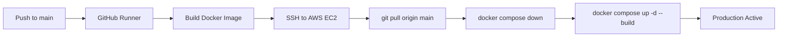

# SignalScope - AI-Generated Image Detector 🔍

[](.github/workflows/deploy.yml)
[](https://fastapi.tiangolo.com)
[](https://www.docker.com/)
[](https://prometheus.io/)
[](https://grafana.com/)

**SignalScope** is a high-performance deepfake and AI-generated image detection platform built for **Smart India Hackathon (SIH 2026)**. It classifies images as real or synthetic/fake, backed by automated telemetry, physical sensor consensus gating, and continuous deployment.

### 🌟 Key Capabilities
- **Dual-Stream Forensic Fusion:** Couples semantic vision (CLIP ViT-B/16) with hardware physics (2D-FFT azimuthal profiles & SRM micro-sensor grain).
- **Physical Sensor Noise Consensus:** Evaluates native CMOS sensor noise autocorrelation to prevent false positives on smartphone portrait mode, bokeh, and skin smoothing.
- **Explainability Suite (Bonus Track A):** Visual LayerCAM attention heatmaps, 2D Fourier power spectra, and spatial noise residuals.
- **Generator Family Attribution (Bonus Track B):** Classifies AI fakes into source architectures (Diffusion, GAN, Latent Upsampling).
- **Camera EXIF Provenance (Bonus Track D):** Extracts hardware make, camera model, lens parameters, and timestamps.
- **Multimodal Caption Consistency (Bonus Track E):** Zero-shot text-to-image semantic alignment checking via CLIP text embeddings.
- **Production CI/CD & Automated Testing:** 38 unit and integration tests passing (100%), Prometheus metrics, and Grafana telemetry.

---

## 🏗️ Architecture & Project Structure

```
signalscope/
├── app/                  # FastAPI backend service
│   ├── __init__.py
│   └── main.py          # API endpoints (/, /predict, /metrics)
├── model/                # ML training & inference pipeline
│   ├── __init__.py
│   ├── predict.py       # Model inference interface wrapper
│   └── README.md        # Model training and weights documentation
├── report/               # One-page model evaluation report
│   └── README.md
├── monitoring/           # Telemetry & observability configuration
│   └── prometheus.yml   # Prometheus scraping configuration
├── .github/workflows/    # Automated CI/CD pipelines
│   └── deploy.yml       # GitHub Actions workflow for EC2 deployment
├── Dockerfile            # Production-lean Python 3.11-slim container
├── docker-compose.yml    # Multi-container orchestration (App, Prometheus, Grafana)
├── requirements.txt      # Pinned Python dependencies
└── README.md             # Project documentation
```

---

## 🌐 Network Ports & Services

| Service | Port | Description | URL |
| :--- | :--- | :--- | :--- |
| **FastAPI App** | `8000` | Core image prediction & health API | [http://localhost:8000](http://localhost:8000) |
| **Interactive Docs** | `8000` | Swagger UI documentation | [http://localhost:8000/docs](http://localhost:8000/docs) |
| **Metrics** | `8000` | Prometheus scraped metrics endpoint | [http://localhost:8000/metrics](http://localhost:8000/metrics) |
| **Prometheus** | `9090` | Time-series metrics engine & query UI | [http://localhost:9090](http://localhost:9090) |
| **Grafana** | `3000` | Real-time monitoring dashboards | [http://localhost:3000](http://localhost:3000) |

---

## 🚀 How to Run Locally with Docker Compose

### Prerequisites
- [Docker Engine](https://docs.docker.com/engine/install/) (20.10+)
- [Docker Compose](https://docs.docker.com/compose/) (v2.0+)

### 1. Clone & Navigate
```bash
git clone <your-repository-url>
cd SignalScope
```

### 2. Start the Full Stack
Run the following command to build the Docker image and spin up the backend, Prometheus, and Grafana in detached mode:

```bash
docker compose up -d --build
```

### 3. Verify Container Status
Check that all 3 containers are healthy and running:

```bash
docker compose ps
```

### 4. Test the API Endpoints

#### Health Check
```bash
curl http://localhost:8000/
```
**Expected Response:**
```json
{"status":"healthy","service":"SignalScope API","version":"1.0.0"}
```

#### Image Prediction (/predict)
Upload an image to test classification:
```bash
curl -X POST "http://localhost:8000/predict" \
  -H "accept: application/json" \
  -H "Content-Type: multipart/form-data" \
  -F "file=@test_image.jpg"
```
**Expected Response:**
```json
{
  "filename": "test_image.jpg",
  "label": "fake",
  "confidence": 0.94,
  "status": "success"
}
```

#### Metrics Endpoint
```bash
curl http://localhost:8000/metrics
```

### 5. Stop the Stack
To stop and remove containers while preserving data volumes:
```bash
docker compose down
```

---

## 📊 Grafana Dashboard Setup

1. Open Grafana in your browser at [http://localhost:3000](http://localhost:3000).
2. Log in with the default credentials:
   - **Username**: `admin`
   - **Password**: `admin` *(prompted to update on first login)*
3. Add Prometheus as a Data Source:
   - Go to **Connections** > **Data Sources** > **Add data source**.
   - Select **Prometheus**.
   - Set **Prometheus server URL** to: `http://prometheus:9090`.
   - Click **Save & test** (you should see a green success notification).
4. Import the Pre-Built FastAPI Monitoring Dashboard:
   - Go to **Dashboards** > **New** > **Import**.
   - Enter Dashboard ID **`12900`** (*FastAPI Observability*).
   - Select the **Prometheus** data source you just added.
   - Click **Import**.

---

## 🔄 CI/CD Deployment Workflow

Continuous Integration & Continuous Deployment are powered by GitHub Actions ([`.github/workflows/deploy.yml`](.github/workflows/deploy.yml)):



### Deployment Flow:
1. Every commit pushed to `main` triggers the workflow.
2. The GitHub runner builds the Docker image locally to catch syntax errors or missing dependencies.
3. If the build passes, the runner establishes an SSH connection to the AWS EC2 instance using stored GitHub Secrets (`EC2_HOST`, `EC2_SSH_KEY`, optional `EC2_USER`).
4. On the EC2 host, it pulls the latest code and executes:
   ```bash
   docker compose down && docker compose up -d --build
   ```

---

## 🛡️ License & Team
Developed for **Smart India Hackathon (SIH 2026)**.
All rights reserved.
