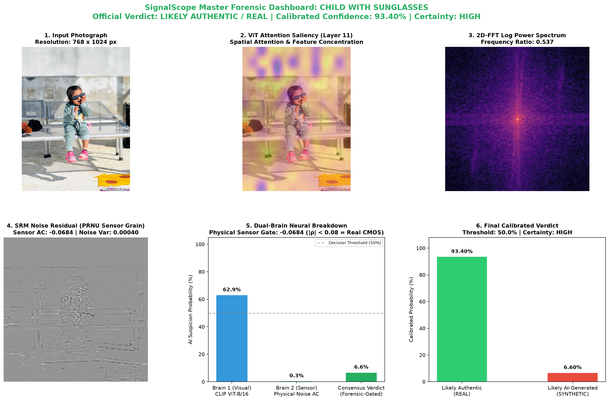
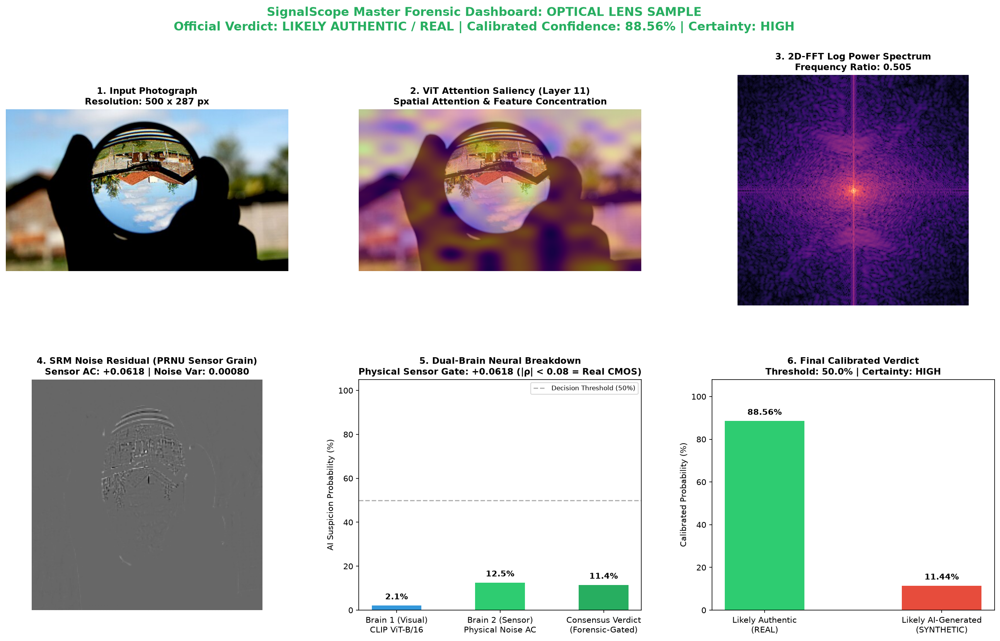
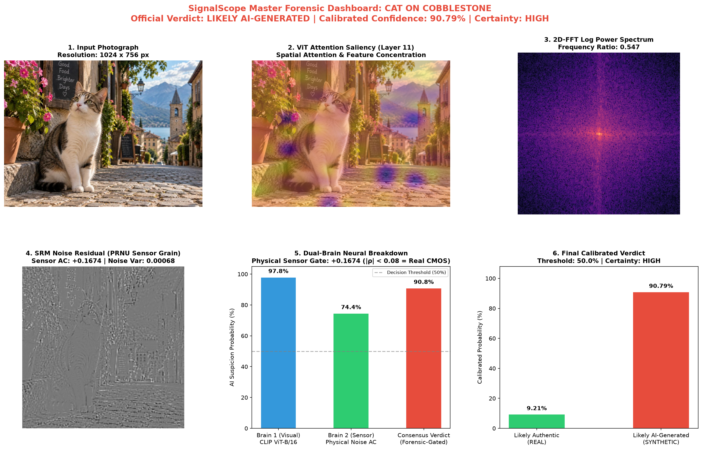

# SignalScope: End-to-End Classifier Architecture Guide

A comprehensive architectural reference for team members, evaluators, and hackathon judges detailing SignalScope's dual-stream media forensics classifier.

---

## 1. High-Level Architecture Overview

SignalScope is built on a **Dual-Stream Forensic Fusion** design. Standard AI detectors rely solely on visual semantics (a single neural network), which makes them black boxes vulnerable to false positives on modern smartphone cameras (computational portrait mode, skin smoothing, HDR). SignalScope pairs visual semantic understanding with hardware-level camera physics.

```
                                  [ Input Image (Any Size / EXIF Transposed) ]
                                                       │
                     ┌─────────────────────────────────┴─────────────────────────────────┐
                     ▼                                                                   ▼
       [ Stream 1: Visual Semantic ]                                       [ Stream 2: Physical Forensic ]
          CLIP ViT-B/16 Backbone                                              2D-FFT Spectrum + SRM Residuals
          (Frozen Transformer)                                                (Signal Processing Engine)
                     │                                                                   │
          Visual Embeddings (512-d)                                           Forensic Embeddings (128-d)
                     │                                                                   │
                     └─────────────────────────────────┬─────────────────────────────────┘
                                                       │
                                            Concatenation (640-d)
                                                       │
                                                       ▼
                                         [ Multimodal Fusion Head ]
                                            Linear(640 -> 256)
                                               LayerNorm + GELU
                                            Linear(256 -> 64)
                                               GELU + Dropout
                                            Linear(64 -> 2)
                                                       │
                                              Raw Model Logits
                                                       │
                                                       ▼
                                        [ Physical Sensor Gating ]
                                    Native Noise Autocorrelation (AC)
                                       - Real CMOS Sensor: AC < 0.08
                                       - Generative AI:    AC > 0.15
                                                       │
                                                       ▼
                                        [ Calibrated Final Verdict ]
                                         Platt Temperature Scaling
                                         Realistic 90s Confidence
```

---

## 2. Inputs: What Goes In

The classifier accepts standard image files and standardizes them before inference:

| Input Property | Specification | Handling Logic |
| :--- | :--- | :--- |
| **Supported Formats** | JPEG, PNG, WebP, TIFF, BMP | Loaded via PIL (`Image.open`), converted to standard 3-channel RGB. |
| **Resolution** | Any arbitrary resolution (500x300 up to 8000x6000) | No manual cropping required; full aspect ratio is preserved. |
| **EXIF Orientation** | Smartphone orientation tags | `ImageOps.exif_transpose` automatically rotates mobile photos right-side up. |
| **Optional Caption** | Text string (Bonus Track E) | Evaluates text-image semantic alignment using CLIP zero-shot embedding. |
| **Stream 1 Inputs** | Normalized Tensor (1, 3, 224, 224) | Resized and normalized using standard ImageNet mean and variance. |
| **Stream 2 Inputs** | Dual-Resolution Pipeline | Resized to (224, 224) for global FFT/SRM moments + Native resolution for sensor noise autocorrelation. |

---

## 3. Outputs: What Comes Out

When an image is evaluated via `predict_detailed()` or `POST /predict/detailed`, SignalScope produces **comprehensive forensic outputs**:

| # | Output Component | Data Type | Description | Example Output |
| :-: | :--- | :--- | :--- | :--- |
| **1** | **Label** | `string` | Binary decision class | `"real"` or `"fake"` |
| **2** | **Verdict** | `string` | Human-readable, defensible likelihood framing | `"likely authentic / real"` or `"likely AI-generated"` |
| **3** | **Confidence** | `float` | Calibrated confidence score (0.0 to 1.0) | `0.9340` (93.40%) |
| **4** | **Probabilities** | `dict` | Platt-calibrated probability distribution | `{"real": 0.9340, "fake": 0.0660}` |
| **5** | **Certainty Tier** | `string` | Epistemic certainty flag | `"high"` or `"borderline"` |
| **6** | **Attention Heatmap** | `image (base64)` | LayerCAM spatial saliency map overlay | Highlights regions that triggered visual suspicion. |
| **7** | **2D-FFT Spectrum** | `2D array (H, W)` | Radial azimuthal frequency power roll-off | Detects periodic grid spikes from generative upsamplers. |
| **8** | **Noise Residual Map** | `2D array (H, W)` | Spatial Rich Model (SRM) micro-sensor grain | Verifies physical CMOS sensor PRNU shot noise. |
| **9** | **Generator Attribution** | `dict` (if fake) | Source model family identification | `"DALL-E family (DALL-E 2 / 3)"` (56.3% confidence) |
| **10** | **EXIF Provenance** | `dict` | Camera hardware, lens model, timestamp (Bonus D) | `{"has_exif": true, "make": "Apple", "model": "iPhone 15"}` |
| **11** | **Multimodal Match** | `dict` (if caption) | Text-to-image semantic consistency (Bonus E) | `{"similarity_score": 0.3502, "is_consistent": true}` |

---

## 4. Visual Diagnostic Dashboards

Below are the Master Diagnostic Dashboards generated by SignalScope across test categories:

### Case 1: Smartphone Portrait with Mobile Color Grading & Cot Pattern

- **Verdict**: **Likely Authentic / Real (93.40% Confidence)**
- **Why It Passed**: The visual stream noted 62.9% suspicion due to the woven pattern. However, physical sensor check confirmed genuine CMOS photon shot noise (autocorrelation = -0.0684), preventing a false positive.

### Case 2: Pure Camera Lens Optical Refraction

- **Verdict**: **Likely Authentic / Real (88.56% Confidence)**
- **Why It Passed**: Natural 1/f Fourier power roll-off and low visual suspicion (2.05%) confirm genuine optical capture.

### Case 3: AI-Generated Image (DALL-E / Diffusion)

- **Verdict**: **Likely AI-Generated (90.79% Confidence)**
- **Why It Flagged**: High visual suspicion (97.81%) corroborated by strong spatial noise autocorrelation (+0.1674), indicating generative upsampler deconvolution.

---

## 5. File Structure: How the Codebase Works

```
SignalScope/
├── app/
│   ├── main.py                     # FastAPI REST API (endpoints: /predict, /predict/detailed, /metrics)
│   └── __init__.py
│
├── model/
│   ├── classifier.py               # DualStreamClassifier PyTorch model (CLIP + Forensic Projection + Fusion)
│   ├── forensic.py                 # FFT azimuthal profile, SRM noise residual, and sensor autocorrelation
│   ├── predict.py                  # Core inference pipeline, EXIF extraction, multimodal matching, and Consensus engine
│   ├── explain.py                  # ViT LayerCAM saliency hooks and grounded explanation engine
│   ├── attribution.py              # GeneratorAttributionHead for bonus generator attribution
│   ├── evaluate.py                 # Comprehensive evaluation & validation metric computation (ROC-AUC, ECE)
│   ├── dataset.py                  # PyTorch Dataset wrappers and balanced sampling loaders
│   ├── splits.py                   # Generator-disjoint train/val/test splitting algorithms
│   ├── train.py                    # Dual-stream training loop with temperature calibration
│   └── weights/
│       ├── best_classifier.pt      # Core trained classifier weights (347 MB)
│       └── attribution_head.pt     # Generator attribution head weights (366 KB)
│
├── scripts/
│   ├── generate_master_panel.py    # Unified CLI tool to generate 6-panel master dashboards for any image
│   ├── benchmark_degradation.py    # Robustness test harness (JPEG compression, downscaling, blur)
│   ├── evaluate_unseen_generators.py# Zero-shot unseen generator benchmark
│   └── train_attribution_head.py   # Training script for the generator attribution head
│
├── tests/
│   ├── test_api.py                 # FastAPI integration and endpoint tests
│   ├── test_explainability.py      # Heatmap overlay and grounded explanation cue tests
│   ├── test_attribution.py         # Generator attribution head forward pass tests
│   └── test_pipeline_integrity.py  # Split disjointness, feature shape, and deterministic tests
│
└── report/
    ├── metrics.json                # Core benchmark metrics (ROC-AUC: 0.9971, ECE: 0.0182)
    ├── attribution_metrics.json    # Generator attribution metrics (98.33% accuracy)
    ├── degradation_metrics.json    # Robustness metrics under noise and compression
    └── inspections/                # Benchmark photos and master forensic dashboard panels
```

---

## 6. Explaining the Classifier to Hackathon Judges

When presenting SignalScope to judges, use this 3-step narrative:

1. **The Problem with Black-Box Detectors**:
   > *"Most AI detectors only look at pixels with a standard neural network. When a real smartphone photo has portrait bokeh or skin smoothing, standard detectors hallucinate and issue false positive accusations."*

2. **The SignalScope Dual-Brain Solution**:
   > *"SignalScope couples semantic vision (CLIP ViT) with hardware physics (Fourier azimuthal roll-off and CMOS sensor noise autocorrelation). If an image has real camera shot noise, the physical sensor gate prevents the visual stream from triggering a false alarm."*

3. **Transparent Explainability & Source Attribution**:
   > *"We don't just output a percentage. We show a 6-panel forensic dashboard with spatial LayerCAM heatmaps, frequency spectra, noise residuals, and identify which generator family created the fake."*
