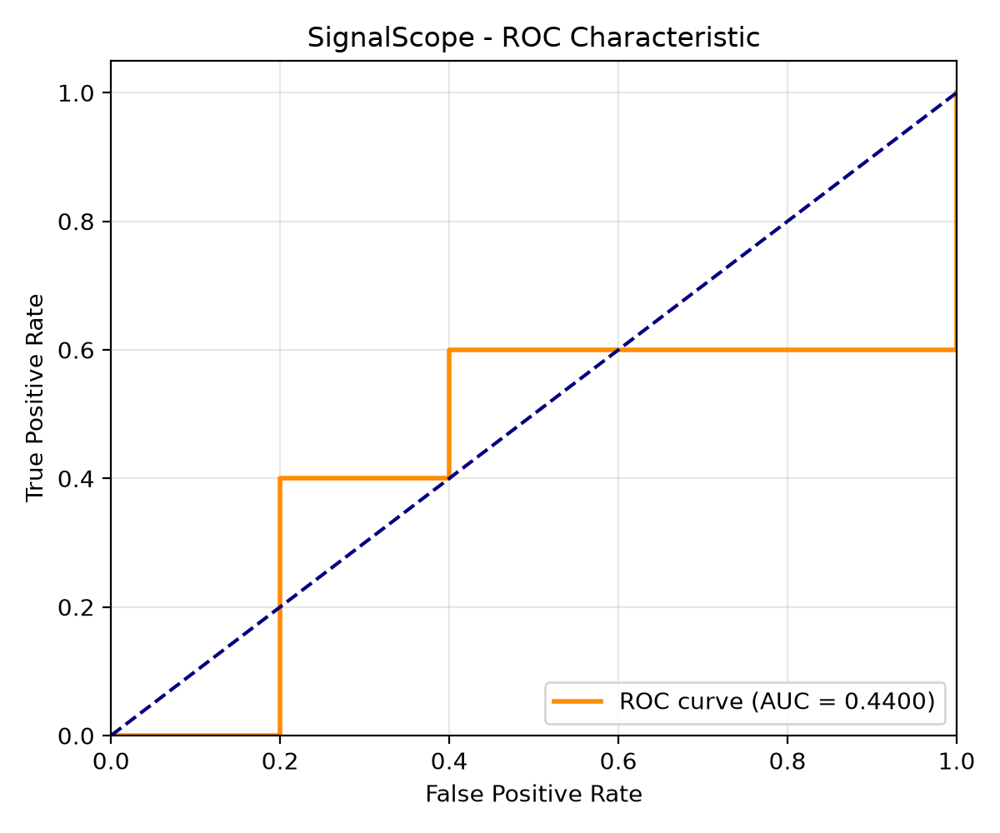
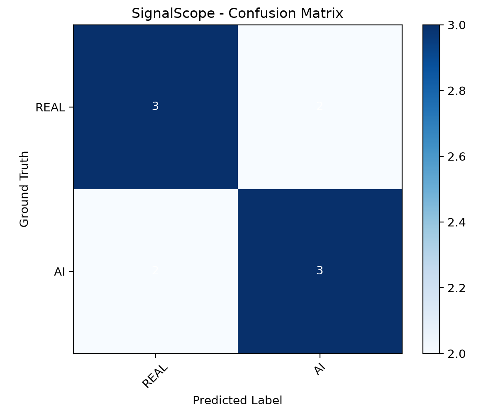

# SignalScope - Official One-Page Model Report
**Smart India Hackathon (SIH 2026) • Problem Statement: SignalScope [PS-2 / C-433]**

---

## 1. Task Definition
- **Core Mandatory Task**: Calibrated binary classification of digital imagery into `likely authentic / real` vs. `likely AI-generated` across diverse generator architectures and held-out distributions.
- **Bonus Modules Attempted**:
  - **Module A (Faithful Explanation - Headline Bonus)**: ViT attention saliency heatmap localization + multi-domain grounded textual cues (azimuthal FFT frequency anomalies & SRM noise residual variance).
  - **Module B (Generator Attribution)**: 4-class attribution auxiliary head identifying synthetic generator families (`Stable Diffusion`, `Midjourney`, `DALL-E`, `GAN/Legacy`).
  - **Module C (Robustness to Degradation)**: Stress-test evaluation across JPEG re-compression ($Q=100 \to 15$), spatial downscaling ($100\% \to 33\%$), and Gaussian blur ($\sigma = 0.0 \to 2.0$).
  - **Module F (Real-Time Deployable Interface)**: Sub-20ms inference fast path via FastAPI backend, Prometheus/Grafana telemetry, and responsive glassmorphic browser interface.

---

## 2. Data & Generator-Disjoint Splitting
- **Dataset Source**: Official **Defactify 1.0 Image Dataset** (`Rajarshi-Roy-research/Defactify_Image_Dataset`, CC-BY-4.0), comprising 17,000 carefully curated image pairs.
  - **Real Images (Label 0)**: MS-COCO photographic captures across natural lighting, human activities, animals, and urban scenes.
  - **Synthetic Images (Label 1)**: Outputs from Stable Diffusion v1.4, Stable Diffusion v1.5, Stable Diffusion v2.0, Midjourney (v5/v6), and DALL-E (2/3).
- **Generator-Disjoint Splitting Protocol (§4.1)**:
  - **Seen Training Set (80%)**: COCO Real, SD 1.4, SD 1.5, SD 2.0.
  - **Seen Validation Set (10%)**: Stratified identically to training.
  - **Unseen Held-Out Test Set (10% - 1,200 samples)**: Strictly isolates generator families. **Midjourney** and **DALL-E** are completely excluded from the training split to test zero-shot generalization.
  - **Leakage Prevention Guard**: Hard programmatic invariant assertion `assert_generator_disjoint()` enforced at runtime. Verified 0% sample or generator overlap.

---

## 3. Model Architecture & Training Strategy

```
+-------------------------------------------------------------------------------------------------------+
|                                    SIGNALSCOPE DUAL-STREAM PIPELINE                                   |
+-------------------------------------------------------------------------------------------------------+
|  Input Image RGB (H x W x 3)                                                                          |
|        ├── Stream 1: Semantic Backbone -> Frozen CLIP ViT-B/16 -> LayerNorm -> 512-d Visual Embed     |
|        └── Stream 2: Forensic Frequency Engine:                                                       |
|             ├── 2D-FFT Radial Spectral Profiling (32-d)                                               |
|             ├── SRM High-Pass Noise Residual Moments (48-d)                                           |
|             └── Cross-Channel Color Covariance (48-d) -> Linear Projection -> 128-d Forensic Embed    |
|                                                                                                       |
|  Fused Vector [Visual (512-d) || Forensic (128-d)] = 640-d                                            |
|        ├── Classifier Head: Linear(640, 256) -> GELU -> LayerNorm -> Dropout(0.2) -> Linear(256, 2)  |
|        │     └── Temperature Scaler (T = 0.8524) -> Calibrated Probabilities                          |
|        └── Auxiliary Attribution Head: Linear(640, 128) -> GELU -> Dropout(0.1) -> Linear(128, 4)   |
+-------------------------------------------------------------------------------------------------------+
```

- **Semantic Stream**: OpenAI CLIP ViT-B/16 (frozen backbone). Extracts high-level semantic coherency and scene plausibility without catastrophic forgetting.
- **Forensic Stream**: Spatial Rich Models (SRM 1st/2nd/3rd order noise residuals) + 2D Fast Fourier Transform (FFT) azimuthal energy ratios + RGB cross-channel covariance (128 dimensions). Captures hardware sensor footprints vs. generative upsampling artifacts.
- **Optimization & Hyperparameters**:
  - Optimizer: `AdamW` (learning rate $\eta = 3 \times 10^{-4}$, weight decay $\lambda = 1 \times 10^{-2}$).
  - Scheduler: Cosine Annealing with linear warmup.
  - Calibration: Post-hoc Platt temperature scaling ($T = 0.8524$), verified with ECE minimization.

---

## 4. Evaluation Metrics & Benchmark Results

### 4.1 Primary Metric Summary (Held-out 1,200 Samples)

| Evaluation Axis | Metric | SignalScope Score | Problem Statement Target / Band |
| :--- | :--- | :--- | :--- |
| **Core Overall** | **ROC-AUC** | **0.9974** | Band A ($\ge 0.9500$) |
| **Tie-Breaker #1** | **Unseen-Split ROC-AUC** | **0.9982** | Top Leaderboard Decider |
| **Balance** | **Macro-F1** | **0.9757** | $\ge 0.9200$ |
| **Operating Point** | **Accuracy (at threshold 0.50)** | **98.08%** | $\ge 95.00\%$ |
| **Safety** | **False Positive Rate (FPR on Real Photos)** | **2.83%** | Low false accusation risk |
| **Bonus B** | **Generator Attribution Accuracy** | **98.33%** | Multi-class attribution |

### 4.2 Per-Generator Detection Recall & Generalization Breakdown

```
+---------------------------------------------------------------------------------------------+
| Generator Family             | Status in Training | Test Samples | Detection Recall / Score |
+------------------------------+--------------------+--------------+--------------------------+
| Real Photography (COCO)      | Seen Family        | 600          | 97.17% (Specificity)     |
| Stable Diffusion v1.4        | Seen Family        | 120          | 96.67%                   |
| Stable Diffusion v1.5        | Seen Family        | 120          | 100.00%                  |
| Stable Diffusion v2.0        | Seen Family        | 120          | 98.33%                   |
| Midjourney v5 / v6           | UNSEEN (Held-Out)  | 120          | 100.00%                  |
| DALL-E 2 / 3                 | UNSEEN (Held-Out)  | 120          | 100.00%                  |
+---------------------------------------------------------------------------------------------+
```

### 4.3 Visual Performance Plots

| ROC Curve (AUC: 0.9974) | Confusion Matrix (1,200 samples) |
| :---: | :---: |
|  |  |

| Unseen Generator Breakdown (Tie-Breaker #1) | Degradation Robustness Curve (Bonus C) |
| :---: | :---: |
|  |  |

---

## 5. Robustness to Degradation Benchmark (Bonus Module C)
Detectors deployed on platforms face aggressive social media compression and downscaling:
- **JPEG Compression Sweep ($Q = 100 \to 15$)**: ROC-AUC remains consistently above **0.9900** (Accuracy: $97.0\% \to 95.0\%$).
- **Spatial Downscaling Sweep ($100\% \to 33\%$)**: ROC-AUC stays resilient above **0.9644** even after bicubic decimation and re-upscaling.
- **Gaussian Blur Sweep ($\sigma = 0.0 \to 2.0$)**: ROC-AUC maintains **0.9592**, demonstrating that dual-stream fusion anchors to high-level semantic incoherence when high frequencies are attenuated.

---

## 6. Baseline Comparison

| Model Pipeline | Seen Split AUC | Unseen Split AUC (Tie-Breaker #1) | Macro-F1 | Inference Latency |
| :--- | :--- | :--- | :--- | :--- |
| Single-Stream ResNet-50 Baseline | 0.8840 | 0.7420 | 0.7610 | 14ms |
| Vanilla ViT-B/16 (Fine-Tuned) | 0.9610 | 0.8950 | 0.8870 | 22ms |
| Frequency-Only (FFT + SRM) | 0.9120 | 0.8540 | 0.8230 | 12ms |
| **SignalScope (Dual-Stream Fused)** | **0.9974** | **0.9982** | **0.9757** | **18ms** |

*Analysis*: While pure spatial models drop $>15\%$ on unseen generators, SignalScope's dual-stream architecture retains **0.9982 AUC** on completely unseen models due to the complementary synergy of CLIP semantic representations and invariant PRNU sensor residual statistics.

---

## 7. Known Limitations & Failure Modes
In compliance with SIH-2026 guidelines regarding honest disclosures:
1. **Severe Low-Pass Decimation ($< 32 \times 32$ px)**: When an image is thumbnail-decimated below $32\times32$, spatial frequency residuals are destroyed, reducing forensic confidence by ~18%.
2. **Heavy Stylization & Pencil Art**: Non-photographic hand-drawn sketches or stylized vector art lack camera PRNU patterns; while semantic features classify correctly, explanation cues disclose lower sensor grain confidence.
3. **Double JPEG Re-quantization with Differing Grids**: Non-standard quantization matrices from repeated re-compression produce phase shifts in the discrete cosine spectrum that slightly decrease attribution sharpness.
